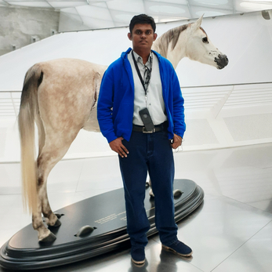
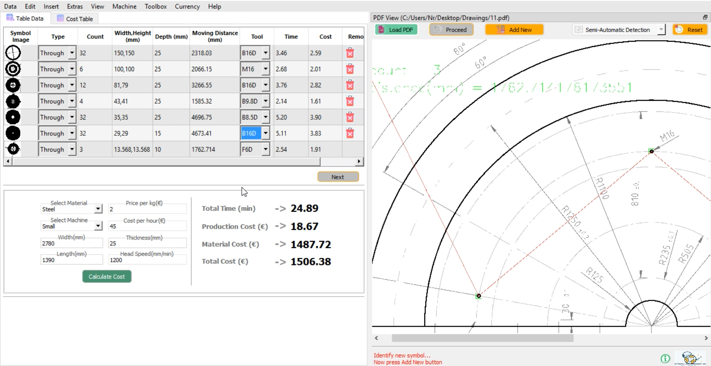
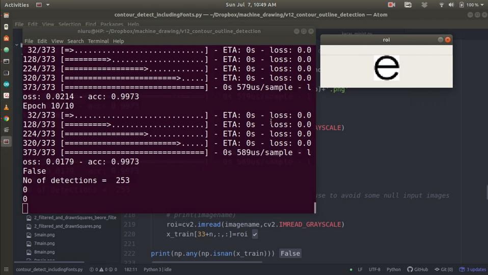
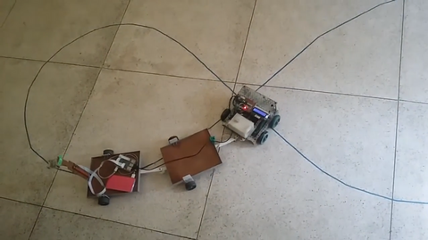
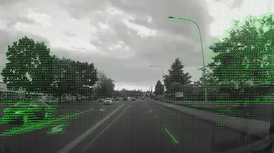

<h1 style="text-align: center;">Niuru's - Technical Portfolio</h1>
<!-- 
 -->
Welcome to my technical portfolio! This repository serves as a collection of my hands-on experience, academic qualifications, and projects.

## Table of Contents
- [About Me](#about-me)
- [Academic Qualifications](#academic-qualifications)
- [Project Highlights](#project-highlights)
- [Other Projects](#other-projects)
- [Contact](#contact)

## About Me

  
  

    I'm a research and development engineer with a keen interest towards applied research and software development. My diverse technical background spans various fields, including computer vision, Python applications, embedded electronics, and control systems.  Apart from that, I have expertise in e-learning solutions, Linux server administration and developing process automation tools.
     
     
    I'm enthusiastic about solving complex problems and creating innovative solutions that bridge the gap between theory and real-world applications.
  

## Academic Qualifications

- **M.Sc Eng. in Electrical and Electronic Engineering (GPA 3.84/4.00)**
  - Graduated from University of Peradeniya, Nov 2019.
  - Specialized in Control Systems and Instrumentation and achieved the highest grades, particularly excelling in subjects such as Pattern Recognition for Smart Systems, Artificial Intelligence for Smart Systems, and Advanced Embedded Systems Design.
  - Thesis title: **Driver assisted steering system for reversing an articulated vehicle.**
  - <a href="theses/msc-thesis.pdf" target="_blank">🗎 View Thesis.</a>
  - <a href="https://www.youtube.com/watch?v=3WWz0k3Fpig" target="_blank"> ▶️ View Project Video.</a>

    

- **B.Sc Engineering (Hons) in Electrical and Electronic Engineering (GPA 3.20/4.00)**
  - Graduated from University of Peradeniya, Oct 2015.
  - Final year project title: **Modeling a driving mechanism for a spherical robot.**
  - This project has won first place at the IEEE undergraduate project symposium, 2015.
  - <a href="theses/bsc-project.pdf" target="_blank">🗎 View Project Report.</a>
  - <a href="https://youtu.be/Dd0xkXaIFKc" target="_blank">▶️ View project Video.</a>

 

## Project Highlights
Following are some interesting projects I've worked on that have immensely helped me gain hands-on experience in research, computer vision, embedded electronics, and programming. 
 
 

### **Vision-Based Technical Drawing Analyzing Software   (Hauptberechnung - Software für Bearbeitungsberechnungen)**
   - I developed a prototype software for the manufacturing industry in Germany that analyzes specific sections of technical drawings and automatically extracts content using computer vision algorithms for production time/cost estimation.
   - Software consist of 4 modes for convinient operation [Halbautonomer Modus, Automatischer Modus, Tabellen Modus,Taschenrechner Modus]
   - **Domains**: *Computer vision*, *Python*, *Machine learning*.
   
        
      
      
       
      
      
      

       

   
  
   <a href="https://www.youtube.com/watch?v=UQYkOeLD5Vo" target="_blank" rel="noopener noreferrer">▶️ See software in action</a>

   

   

    

   

   <a href="https://www.youtube.com/watch?v=RgiKApZXbhc" target="_blank" rel="noopener noreferrer">▶️ Glimpse into the interior </a>

   
   

 

### **Spoof Detection Algorithm**
   - A spoof detection solution developed for face recognition based access control system. 
   - Methods were developed to recognize spoofing attempts based on classical methods and trained datasets. The developed method can differentiate a real face and a face on a digital display.
   - This system was integrated with existing monocular surveillance cameras to enable contactless access control during Covid-19.
   - **Domains**: *Computer vision*, *Machine learning*, *Python*.

      
      
        
      
       
      
      <a href="https://www.youtube.com/watch?v=RlmB60kQhCA" target="_blank" rel="noopener noreferrer">▶️ See algorithm in action</a>

      

 

### **Driver assist system for reversing long articulated vehicles**
   - An innovative solution developed for reversing two pivoted articulated vehicles while keeping the stability. Fully automatic prototype and a semi autonomous prototype was built.

   - **Domains**:  *Robotics*, *Computer vision*, *Control systems*, *Embedded electronics*, *C++*.

        
      
      
      
      

       

      <a href="https://www.youtube.com/watch?v=3WWz0k3Fpig" target="_blank" rel="noopener noreferrer"> ▶️ See Project Video</a>

      

 

### **Monocular Vision-Based Obstacle Avoidance Algorithm and Networking Infrastructure for Controlling Remote Mobile Robots**
   - Development of a vision-based monocular obstacle-avoidance algorithm for mobile robots. A prototype was built, and the algorithm was tested, incorporating optical flow and edge-based obstacle avoidance methods.
	- As a part of the requirement an infrastructure developed for remotely controlling mobile robots by processing data with minimal onboard hardware. 
   - **Domains**: *Computer vision*, *Control systems*, *Robotics*, *Embedded electronics*.

        
      

       

       <a href="https://www.youtube.com/watch?v=KRkiUrKuoGE" target="_blank" rel="noopener noreferrer"> ▶️ See Project Video</a>

      

 

### **Erasmus+ Capacity Building Project (TEAL2.0 - Technology Enabled Active Learning)**

- Project page: <a href="https://teal.cs.ait.ac.th" target="_blank"> https://teal.cs.ait.ac.th </a>
- The TEAL 2.O project is implemented by a consortium of 11 universities from Sri Lanka, India, Thailand, Italy, Norway and Romania. The TEAL2.O project will develop and deploy an open access platform for technology-enabled learning environment that will facilitate the design and delivery of quality ODL in Science & Technology higher education.
- I Worked as a developer and as a teacher/trainer/reseacher to bring project a success. I was resposible for developments, deployments and testing of the application in the servers.
- Apart from that I did Linux server management and Moodle administration across partner universities in Thailand, India and Sri
Lanka.
- **Domains**: *Web applications*, *API*, *Moodle*, *Linux*, *Server administration*,*Databases*, *Database clusters*. 

   
   
   
   

   
   
   
    
    

- Partner map

     

 

### **Coursera course selection tool**
- An app for students to easily search for optimum courses to study using various search criteria.
- Visit app: <a href="https://apps.sltc.ac.lk/coursera-course-selection" target="_blank"> https://apps.sltc.ac.lk/coursera-course-selection </a>

<!--  

### **LMS analytics dashboard**
- Web-based dashboards to view student/teacher performance and admin panel to generate weekly attendance.

 

### **Time table search tool**
-  Entire university timetable at one place where anyone can search by subjects, rooms, teachers etc. -->

 

## Other Projects

### **Semi-Automated Fabric Puller Machine**
- Creation of a machine to semi-automate the turning mechanism of fabric straps, allowing processing of multiple straps simultaneously.
- I developed the embedded software and the electronic design for the machine. Completed during undergraduate industrial training.
- <a href="https://youtube.com/shorts/NxAfiiuhjH0" target="_blank">
   https://youtube.com/shorts/NxAfiiuhjH0
   </a>

### **Fully Automated Elastic Ring Machine**
- Development of a fully automated machine capable of stitching elastic rings at different sizes when raw materials are loaded.
- I contrubuted to the project by writing the embedded software and designing the electronics.  Completed during undergraduate industrial training.
- <a href="https://youtu.be/ZxNXgUo5cGw" target="_blank">
   https://youtu.be/ZxNXgUo5cGw
   </a>

### **2D Plotter**
- A simple 2D plotter based on GRBL made as a hobby project, capable of wireless connectivity with computers through Bluetooth for sending G-codes.
- <a href="https://youtu.be/J0Gonuj2iAM" target="_blank">
   https://youtu.be/J0Gonuj2iAM
   </a>

### **Smart Garden**
- An IoT hobby project, with the ability to automatically control the lighting conditions, watering the plants according
   to the requirements, sending Twitter alerts in emergencies and monitoring the parameters over the internet.
- <a href="other/smartGarden.pdf" target="_blank">🗎 View block diagram. </a>

### **Semi Autonomous Mobile Robot Platform for Patient Monitoring**
- I contributed to this project by integrating the IP cameras with NVIDIA® Jetson and developing the OpenCV, Python pipeline for accessing the cameras.  
- <a href="https://www.youtube.com/watch?v=Uwk4hrYcE8U" target="_blank">
   https://www.youtube.com/watch?v=Uwk4hrYcE8U
   </a>

 

## Contact

- <a href="https://github.com/nrnw" target="_blank">
   Github
   </a>
- <a href="https://www.linkedin.com/in/niurur" target="_blank">
   LinkedIn
   </a>
- Send a message
   
    
   
   <form action="https://formspree.io/f/mpzgbbpw" method="POST">

   <label style="display: block; margin-bottom: 10px;">
      Your name:
      <input type="text" name="name" style="display: block; width: 250px;">
   </label>

   <label style="display: block; margin-bottom: 10px;">
      Your email:
      <input type="email" name="email" style="display: block; width: 250px;">
   </label>

   <label style="display: block; margin-bottom: 10px;">
      Your message:
      <textarea name="message" style="display: block; width: 250px;height: 50px;"></textarea>
   </label>

   <button type="submit">Send</button>
   </form>

