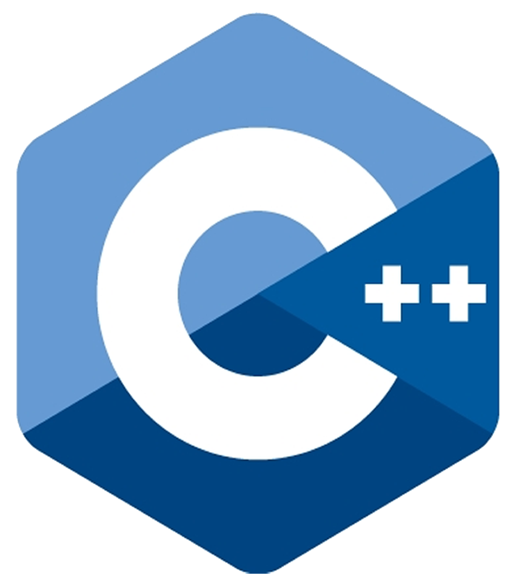
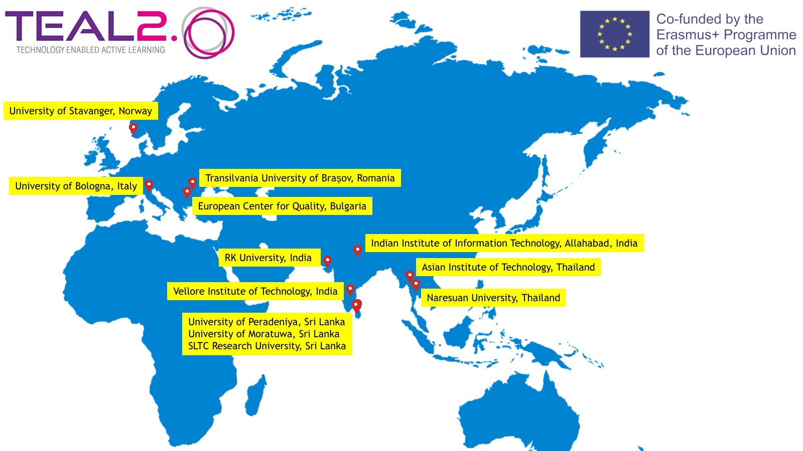
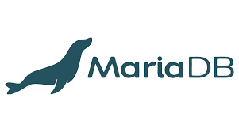

# Niuru Ranaweera's Technical Portfolio

Welcome to my technical portfolio! This repository serves as a collection of my hands-on experience, academic qualifications, and projects.

## Table of Contents
- [About Me](#about-me)
- [Academic Qualifications](#academic-qualifications)
- [Project Highlights](#project-highlights)
- [Projects](#projects)
- [Contact Information](#contact-information)

## About Me

  
  

    I'm a research and development engineer with strong interest in applied research and software development. My background encompasses embedded electronics, control systems, Python web applications, and Linux server administration. Apart form that I'm expertised in e-learning solutions, Moodle administration and developing process automation tools.
  

<!--
I'm a research and development engineer with strong interest in applied research and software development. My background encompasses embedded electronics, control systems, Python web applications, and Linux server administration.

Apart form that I'm expertied in e-learning solutions, Moodle administration and developing academic process automation tools.
--> 

## Academic Qualifications

- **M.Sc Eng. in Electrical and Electronic Engineering (GPA 3.84/4.00)**
  - Graduated from University of Peradeniya, Nov 2019.
  - I specialized in Control Systems and Instrumentation and achieved the highest grades, particularly excelling in subjects such as Pattern Recognition, Artificial Intelligence, and Embedded Systems.
  - Thesis title: **Driver assisted steering system for reversing an articulated vehicle.**
  - <a href="theses/msc-thesis.pdf" target="_blank">View Thesis.</a>
  - <a href="https://www.youtube.com/watch?v=3WWz0k3Fpig" target="_blank"> ▶️ View Project Video.</a>

- **B.Sc Engineering (Hons) in Electrical and Electronic Engineering (GPA 3.20/4.00)**
  - Graduated from University of Peradeniya, Oct 2015
  - Final year project title: **Modeling a driving mechanism for a spherical robot.**
  - This project has won first place at the IEEE undergraduate project symposium 2015.
  - <a href="theses/bsc-project.pdf" target="_blank">View Project Report.</a>
  - <a href="https://youtu.be/Dd0xkXaIFKc" target="_blank">▶️ View project Video.</a>

## Project Highlights
Following are some interesting projects I've worked on that have immensely helped me gain hands-on experience in research, computer vision, control systems, and programming. 

- ### **Vision-Based Technical Drawing Analyzing Software (Hauptberechnung - Software für Bearbeitungsberechnungen)**
	- I developed a prototype software for the manufacturing industry in Germany that analyzes specific sections of technical drawings and automatically extracts content using computer vision algorithms.
   - This software is intended to use for the time and cost estimation for the production.
   - Software consist of 4 modes [Halbautonomer Modus, Automatischer Modus, Tabellenmodus,Taschenrechner-Modus]
   - **Domains**: *Computer vision*, *Python*, *Machine learning*.
   
        
      
      

      
      
      

      <a href="https://www.youtube.com/watch?v=UQYkOeLD5Vo" target="_blank" rel="noopener noreferrer">▶️ See software in action</a> (Add combined full video here)

      

      
      <a href="https://www.youtube.com/watch?v=RgiKApZXbhc" target="_blank" rel="noopener noreferrer">▶️ Glimpse into the interior </a>

      

- ### **Spoof Detection Algorithm**
	- A spoof detection solution for existing face recognition based access control system.
Developed a method to recognize spoofing attempts based on classical methods and trained
datasets. The developed method can differentiate a real face and a face on a digital display.
   - This integrated with existing monocular surveillance cameras to enable contactless door unlocking during Covid-19.
   - **Domains**: *Computer vision*, *Python*.

      
      
        

      <a href="https://www.youtube.com/watch?v=RlmB60kQhCA" target="_blank" rel="noopener noreferrer">▶️ See algorithm in action</a>

      

- ### **Driver assist system for reversing long articulated vehicles**
	- An innovation for reversing two pivoted articulated vehicles while keeping the stability. Fully automatic prototype and a semi autonomous prototype was built.

   - **Domains**: *Control systems*, *Robotics*, *Computer vision*, *Embedded electronics*, *C++*.

        
      
      
      
      

      <a href="https://www.youtube.com/watch?v=3WWz0k3Fpig" target="_blank" rel="noopener noreferrer"> ▶️ See Project Video</a>

      

- ### **Monocular Vision-Based Obstacle Avoidance Algorithm and Networking Infrastructure for Controlling Remote Mobile Robots**
	- Development of a vision-based monocular obstacle-avoidance algorithm for mobile robots. A prototype was built, and the algorithm was tested, incorporating optical flow and edge-based obstacle avoidance methods.
	- Creation of an infrastructure for remotely controlling mobile robots by processing data with minimal onboard hardware. Developed in conjunction with the monocular obstacle-avoiding project
   - **Domains**: *Control systems*, *Robotics*, *Computer vision*, *Embedded electronics*.

        
      

       <a href="https://www.youtube.com/watch?v=KRkiUrKuoGE" target="_blank" rel="noopener noreferrer"> ▶️ See Project Video</a>

      

- ### **Erasmus+ Capacity Building Project (TEAL2.0 - Technology Enabled Active Learning)**
   
   - The TEAL 2.O project is implemented by a consortium of 11 universities from Sri Lanka, India, Thailand, Italy, Norway and Romania. The TEAL2.O project will develop and deploy an open access platform for technology-enabled learning environment that will facilitate the design and delivery of quality ODL in Science & Technology higher education.
   - I Worked as a developer and as a teacher/trainer/reseacher to bring project a success. I was resposible for developments, deployments and testing of the application. 
   - Project page: https://teal.cs.ait.ac.th
   - **Domains**: *Web applications*, *API*, *Moodle*, *Linux*, *Server administration*,*Databases*. 

      
      
      
      
     
     
      
      
      

## Other Projects

1. **IoT-Based Wi-Fi Switch Design**
   - Description: Development of an ESP8266-based device that can be controlled from a centralized server, facilitating access control system management. This design offers wireless, low-cost installation and is adaptable for integration with face and gesture recognition systems.

7. **Semi-Automated Fabric Puller Machine**
   - Description: Creation of a machine to semi-automate the turning mechanism of fabric straps, allowing processing of multiple straps simultaneously.
   - https://youtube.com/shorts/NxAfiiuhjH0

8. **Fully Automated Elastic Ring Machine**
   - Description: Development of a fully automated machine capable of stitching elastic rings at different sizes when raw materials are loaded.
   - https://youtu.be/ZxNXgUo5cGw

2. **2D Plotter**
   - *Description*: A simple 2D plotter based on GRBL, capable of wireless connectivity with computers through Bluetooth for sending G-codes.
   - https://youtu.be/J0Gonuj2iAM

4. **Portable ECG Monitor**
   - *Description*: A portable ECG monitoring device prototype that interfaces with smartphones. The system includes a battery-operated hardware device with ECG probes and an Android application. The device connects to the smartphone wirelessly via low-power Bluetooth and can analyze the ECG wave, providing notifications for abnormalities and displaying the BPM. Developed as part of a group project for ACES Hackathon.

5. **Smartphone Controlled Wireless Robot**
   - *Description*: A robot controlled via Bluetooth using an Android application, with the road view displayed through an IP camera.

6. **POV Display**
   - *Description*: An LED display that uses the persistence of vision to display patterns or characters. It was implemented using a PIC877A MCU.

## Contact Information

- GitHub: [GitHub Profile](https://github.com/nrnw)
- LinkedIn: [LinkedIn Profile](https://www.linkedin.com/in/___)
- Email: email@email.com

