<h1 style="text-align: center;">Niuru's - Technical Portfolio</h1>
<!-- 
 -->

Linux Infrastructure • AWS • Azure • Automation • CI/CD • Python

## Table of Contents

- [About Me](#about-me)
- [Certifications](#certifications)
- [Core Skills](#core-skills)
- [Professional Experience](#professional-experience)
- [Infrastructure & Cloud Projects](#infrastructure--cloud-projects)
- [Software, Research & Engineering Projects](#software-research--engineering-projects)
- [Other Engineering Projects](#other-engineering-projects)
- [Education](#education)
- [Contact](#contact)

## About Me

  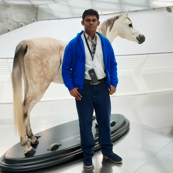
  

    

I am a DevOps and Cloud Engineer with experience in Linux server administration, infrastructure automation, CI/CD, and cloud platforms such as AWS and Azure.

Over the years, I have worked on deploying and maintaining Linux-based applications and services, automating system administration tasks, managing databases and web services, and integrating different software and infrastructure components. My work has also included monitoring, networking, IoT systems, backend development, and troubleshooting across different environments.

My background in electrical and electronic engineering has also given me experience with embedded systems, computer vision, control systems, and hardware-software integration. This helps me understand systems beyond the application layer and work comfortably across infrastructure, software, networking, and hardware.

   

  

## Certifications

  

    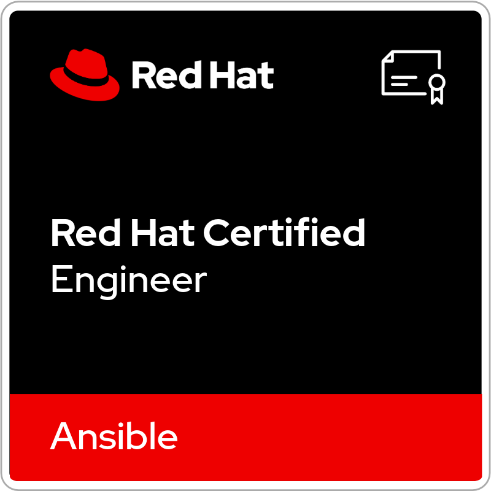
    
<strong>Red Hat Certified Engineer (RHCE)</strong>

  

  

    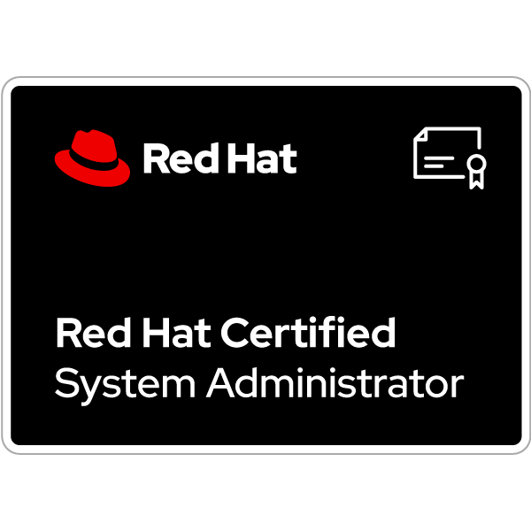
    
<strong>Red Hat Certified System Administrator (RHCSA)</strong>

  

  

    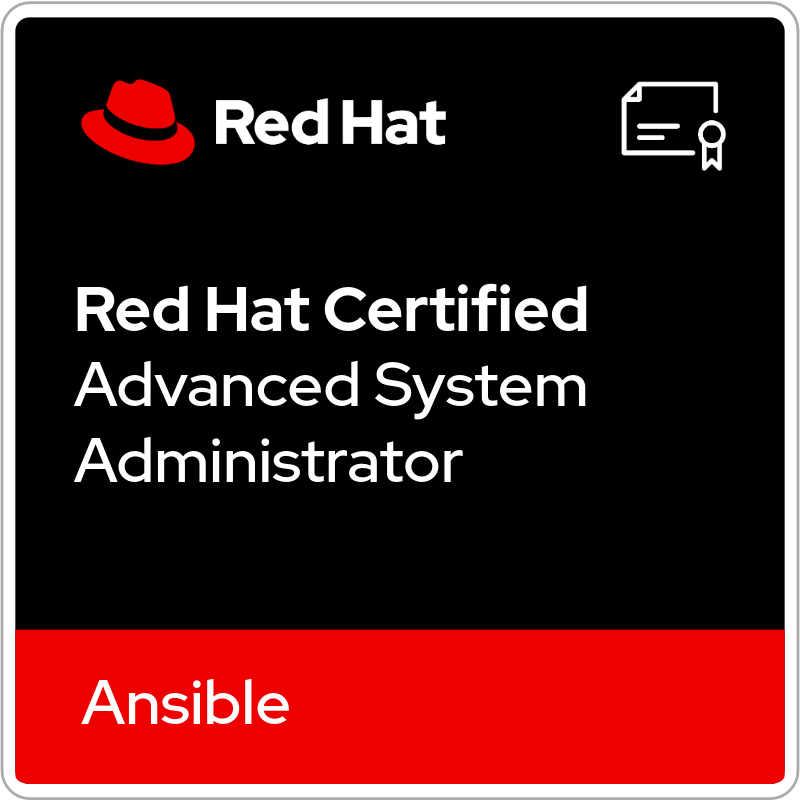
    
<strong>Red Hat Certified Specialist in Ansible Automation</strong>

  

  

    
    
<strong>AWS Certified Solutions Architect – Associate</strong>

  

## Core Skills

- **Linux & System Administration:** RHEL, Ubuntu, systemd, Nginx, server deployment, monitoring, troubleshooting and performance optimization
- **Cloud Platforms:** AWS, Azure
- **Automation & Scripting:** Ansible, Bash, Python
- **CI/CD & Deployment:** CI/CD pipelines, application deployment, deployment automation, and server migrations
- **Monitoring:** Prometheus, Grafana, system and application monitoring
- **Databases:** PostgreSQL, MySQL, TimescaleDB
- **Backend & Integration:** Python, FastAPI, REST APIs, MQTT
- **Networking:** TCP/IP, server networking, network troubleshooting, Cisco, Aruba and Juniper
- **Tools & Platforms:** Git, Docker, Moodle, Windows Server

## Professional Experience

### Senior DevOps Engineer - Orise Innovations (Pvt) Ltd
**Jan 2024 - Present | Remote**

- Manage and monitor Linux servers running client applications, focusing on availability, performance, and troubleshooting.
- Deploy and configure web applications and manage supporting services including PostgreSQL and MySQL databases.
- Implement and maintain CI/CD pipelines to automate application deployments.
- Work with AWS and Azure infrastructure for application deployment, configuration, migration, and performance or cost optimization.
- Perform server migrations and configuration improvements while minimizing disruption to running services.
- Develop Python and FastAPI applications and APIs when backend development or system integration is required.
- Design and implement IoT backend solutions using MQTT and TimescaleDB for real-time data collection and storage.

### Erasmus+ Capacity Building Project - TEAL 2.0
**Nov 2022 - Nov 2023 | Part-time, Remote**

- Contributed to the development and deployment of the TEAL 2.0 e-learning platform, including Python applications and Moodle customization.
- Deployed and tested applications, fixed issues, and supported the platform during regular operation.
- Managed Linux production servers and Moodle instances used by partner universities in Sri Lanka, India, and Thailand.
- Provided technical support and training to users while helping maintain the stability and security of the platform.

### Consultant - Center for Education Innovation, Sri Lanka Technological Campus
**Dec 2021 - Dec 2023**

- Developed, deployed, and maintained Python applications used to automate internal processes.
- Developed data analysis and automation tools together with interactive dashboards.
- Maintained and improved Moodle-based e-learning systems.
- Managed Linux server infrastructure and provided technical support for university systems and administrative applications.

### Systems Engineer - VSIS (Pvt) Ltd
**Apr 2016 - Aug 2016**

- Worked on network infrastructure projects using Cisco, Aruba, and Juniper systems.
- Conducted site inspections, analyzed customer requirements, and supported the design and implementation of network solutions.

## Infrastructure & Cloud Projects
These are some of the infrastructure and cloud-related systems I have worked on, including Linux-based deployments, IoT backends, databases, APIs, and application platforms.
 
 
### Cloud-Integrated IoT Data Logger (NodeMCU & TimescaleDB)

I designed and implemented an IoT data collection system using ESP8266 devices and a cloud-hosted Linux server.

- Sensor data is transmitted using **MQTT over TLS** to a **Mosquitto broker** running on a Linux VM.
- A dedicated Linux service processes the received messages and stores the data in **PostgreSQL with TimescaleDB**.
- **MQTT QoS 2** is used where reliable message delivery is required.
- A **FastAPI** backend provides access to the collected data for other applications, with API-key based authentication.
- The main components run as separate services, which makes deployment, maintenance, and troubleshooting easier.

**Technologies:** Linux, Python, FastAPI, MQTT, Mosquitto, PostgreSQL, TimescaleDB, TLS, systemd

 
 

<!-- Placeholder for Project Image -->
<!--  -->

 

### TEAL 2.0 Platform Infrastructure
**Erasmus+ Capacity Building Project — Technology Enabled Active Learning**

TEAL 2.0 was an international university project involving 11 partner universities across Sri Lanka, India, Thailand, Italy, Norway, and Romania.

I worked on the development, deployment, testing, and maintenance of the platform. My work also included Linux server administration and Moodle administration for partner universities in Sri Lanka, India, and Thailand.

- Deployed and maintained applications on **Linux servers**.
- Managed and configured **Moodle** instances used by partner universities.
- Worked with **Nginx**, databases, and supporting application services.
- Tested deployments, troubleshot application and server-side issues, and supported the platform during regular operation.
- Worked with **MariaDB/Galera** database infrastructure and Python-based applications.
- Provided technical support and training for users and administrators.

**Technologies:** Linux, Ubuntu, Nginx, Python, Moodle, MariaDB, Galera, web applications, databases

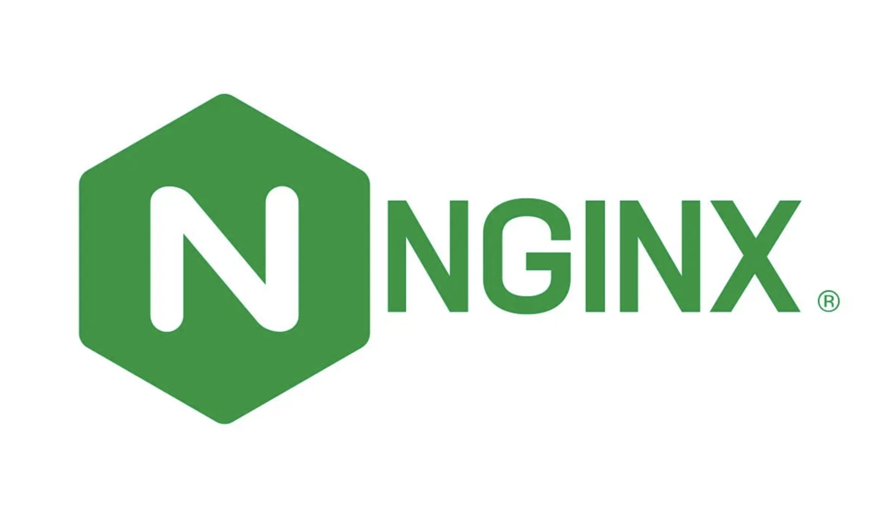

 
 

Project page:
<a href="https://teal.cs.ait.ac.th" target="_blank">TEAL 2.0</a>

 
 

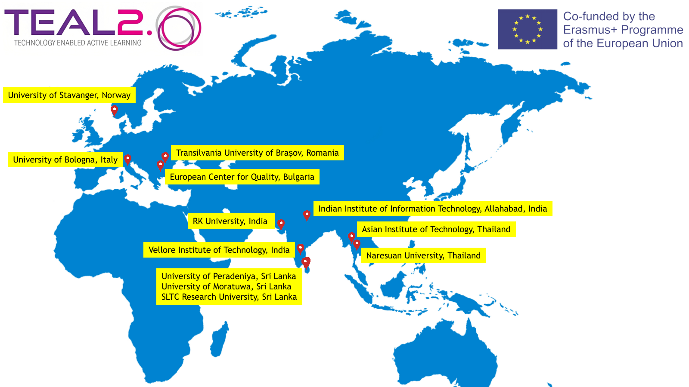

## Software, Research & Engineering Projects

These are some selected projects from my previous work in software development, computer vision, robotics, control systems, and embedded engineering.

### Research & Engineering Projects

#### Vision-Based Technical Drawing Analysis Software
**Hauptberechnung – Software für Bearbeitungsberechnungen**

I developed a prototype application for the manufacturing industry in Germany to analyze selected areas of technical drawings and automatically extract information required for production time and cost estimation.

- Computer vision algorithms were used to identify and process information from technical drawings.
- The application included four operating modes: semi-automatic, automatic, table, and calculator modes.
- The software was developed as a desktop application with a graphical user interface.

**Technologies:** Python, OpenCV, NumPy, TensorFlow, Keras, Qt

 

<a href="https://youtu.be/Z7qGtxPWRwk" target="_blank" rel="noopener noreferrer">▶️ See software in action</a>

 

<a href="https://youtu.be/Z7qGtxPWRwk" target="_blank">
  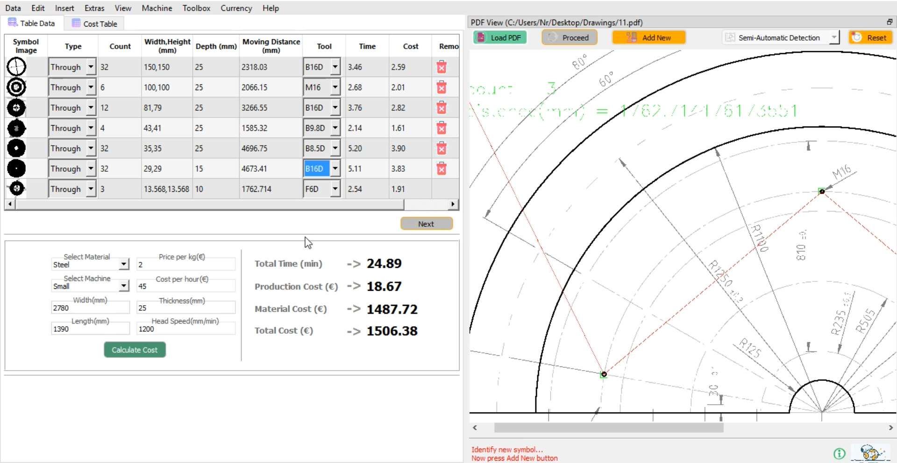
</a>

 

<a href="https://www.youtube.com/watch?v=RgiKApZXbhc" target="_blank" rel="noopener noreferrer">▶️ Glimpse into the internal processing</a>

 

<a href="https://www.youtube.com/watch?v=RgiKApZXbhc" target="_blank">
  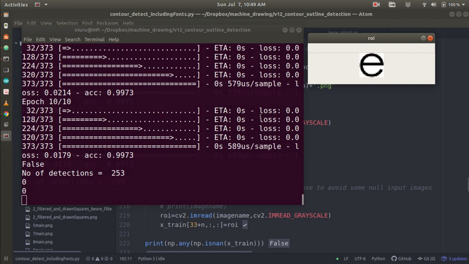
</a>

 
 

#### Spoof Detection Algorithm

I developed a spoof detection method for an existing face-recognition-based access control system.

- The system was designed to differentiate between a real face and a face displayed on a digital screen.
- Both classical computer vision methods and trained datasets were used during development.
- The solution was integrated with existing monocular surveillance cameras to support contactless access control during the COVID-19 period.

**Technologies:** Python, Cython, OpenCV, Computer Vision, Machine Learning

 

<a href="https://www.youtube.com/watch?v=RlmB60kQhCA" target="_blank" rel="noopener noreferrer">▶️ See algorithm in action</a>

 

 
 

#### Driver Assist System for Reversing Articulated Vehicles

This project was developed as part of my postgraduate research on reversing articulated vehicles while maintaining system stability.

- A fully automated small-scale prototype was developed to test the control algorithms.
- An industrial-scale driver-assisted prototype was also developed.
- Computer vision was used for path detection and later for measuring vehicle pivot angles.
- The system combined control algorithms, embedded electronics, computer vision, and a driver interface.

**Technologies:** C++, OpenCV, Raspberry Pi, MATLAB, Octave, Embedded Systems, Control Systems

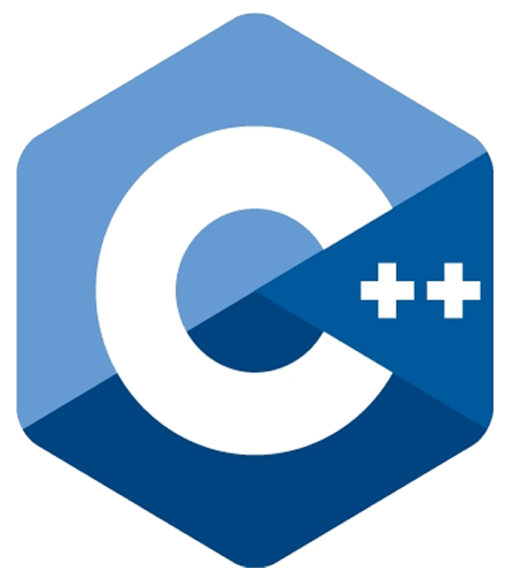

 

<a href="https://www.youtube.com/watch?v=3WWz0k3Fpig" target="_blank" rel="noopener noreferrer">▶️ See project video</a>

 

<a href="https://www.youtube.com/watch?v=3WWz0k3Fpig" target="_blank">
  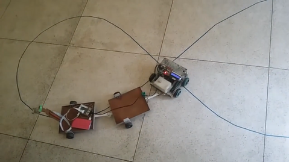
</a>

 
 

#### Monocular Vision-Based Obstacle Avoidance and Remote Robot Control

I developed and tested a monocular vision-based obstacle avoidance algorithm for a mobile robot prototype.

- Optical-flow and edge-based methods were used for obstacle detection and avoidance.
- A supporting network architecture was developed to remotely process data while keeping the onboard computing requirements low.
- The project combined computer vision, networking, robotics, and embedded systems.

**Technologies:** Python, OpenCV, Computer Vision, Robotics, Networking

 

<a href="https://www.youtube.com/watch?v=KRkiUrKuoGE" target="_blank" rel="noopener noreferrer">▶️ See project video</a>

 

<a href="https://www.youtube.com/watch?v=KRkiUrKuoGE" target="_blank">
  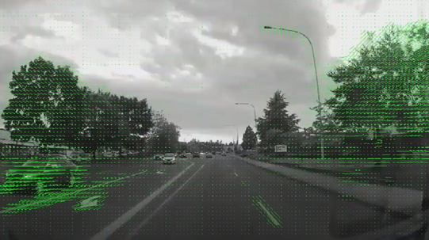
</a>

 
 

### Software & Automation Projects

#### Coursera Course Selection Tool

I developed a web application to help students search and select suitable Coursera courses using different search criteria.

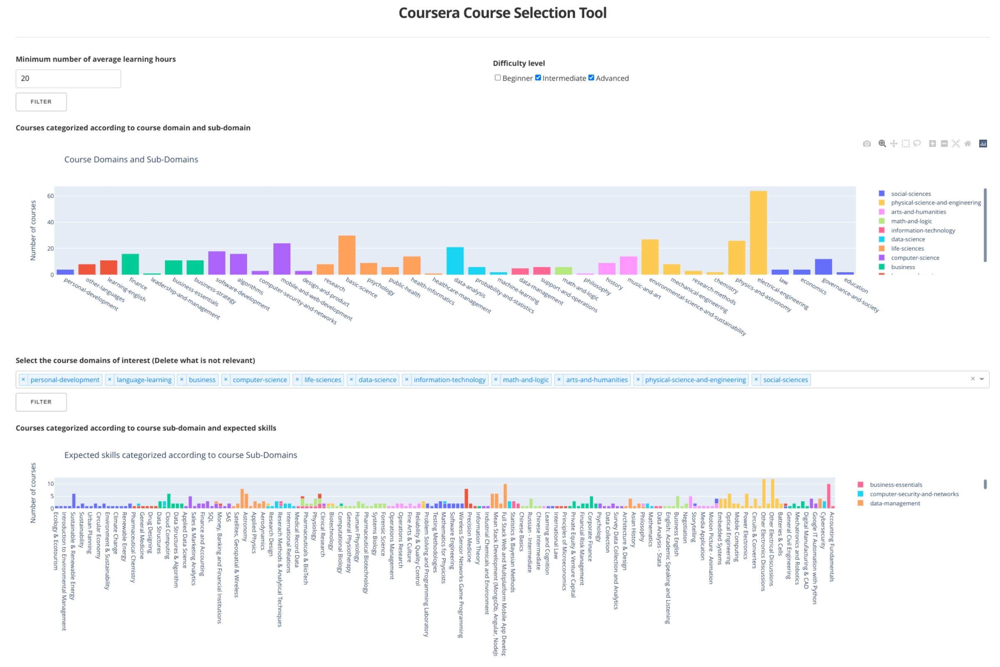

 
 

#### LMS Analytics Dashboard

I developed web-based dashboards for viewing student and teacher activity, together with an administrative interface for generating weekly attendance information.

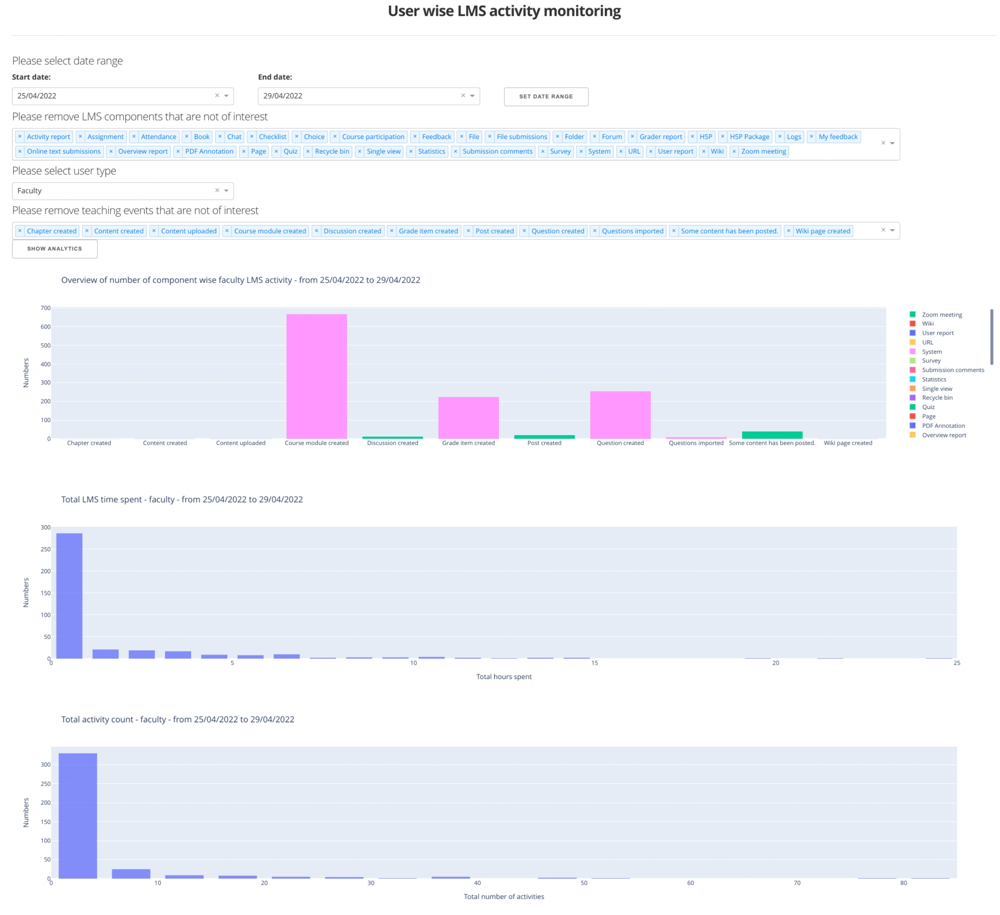

 
 

#### Timetable Search and Course Rescheduling Tool

I developed a web application that brings the university timetable into a single searchable interface.

- Timetable entries can be searched by subject, room, lecturer, and other criteria.
- Administrative users can reschedule classes while the system identifies available time slots and lecture rooms.
- Potential clashes involving lecturers and students are filtered during rescheduling.

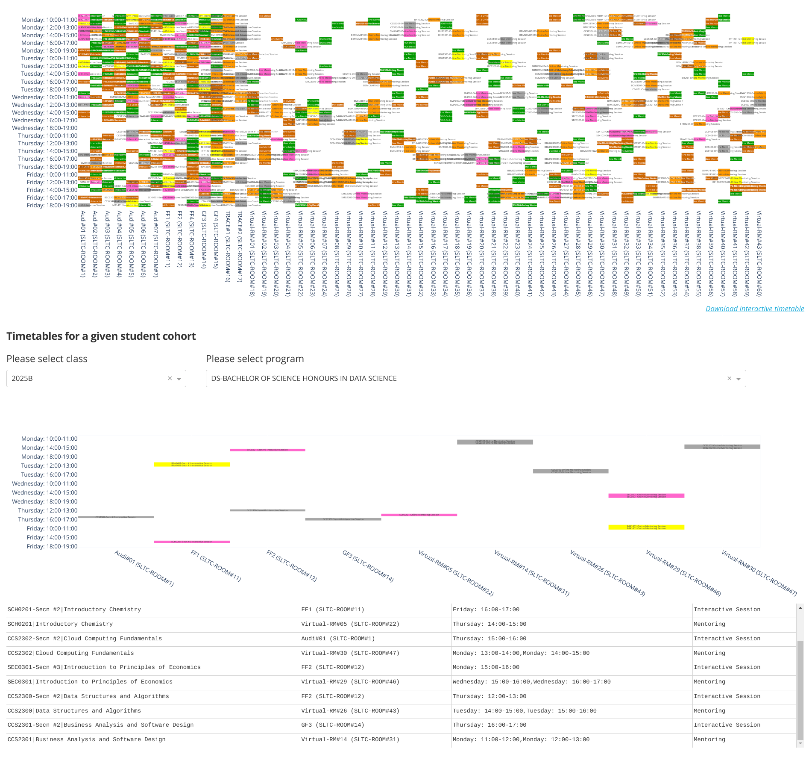

 
 

## Other Engineering Projects

A few additional projects from my work in embedded systems, automation, robotics, and IoT.

### Semi-Autonomous Mobile Robot Platform for Patient Monitoring

I contributed to the project by integrating IP cameras with an NVIDIA Jetson platform and developing the Python/OpenCV pipeline used to access and process the camera feeds.

<a href="https://www.youtube.com/watch?v=Uwk4hrYcE8U" target="_blank" rel="noopener noreferrer">▶️ See project video</a>

 

### Semi-Automated Fabric Puller Machine

Developed during my undergraduate industrial training.

- I developed the embedded software and electronic design for a machine used to semi-automate the turning of fabric straps.
- The system was designed to process multiple fabric straps at the same time.

<a href="https://youtube.com/shorts/NxAfiiuhjH0" target="_blank" rel="noopener noreferrer">▶️ See machine in action</a>

 

### Fully Automated Elastic Ring Machine

Developed during my undergraduate industrial training.

- I contributed to the development of a machine that automatically produces elastic rings in different sizes.
- My work included embedded software development and electronic system design.

<a href="https://youtu.be/ZxNXgUo5cGw" target="_blank" rel="noopener noreferrer">▶️ See machine in action</a>

 

### 2D Plotter

A hobby project based on GRBL, with Bluetooth connectivity for sending G-code wirelessly from a computer.

<a href="https://youtu.be/J0Gonuj2iAM" target="_blank" rel="noopener noreferrer">▶️ See project video</a>

 

### Smart Garden

A small IoT project developed to monitor and automatically control basic garden conditions.

- Automatically controls lighting and plant watering based on configured conditions.
- Monitors system parameters over the internet.
- Sends alerts when abnormal conditions are detected.

<a href="other/smartGarden.pdf" target="_blank">🗎 View block diagram</a>

 

## Education

### M.Sc. in Engineering - University of Peradeniya
**2019 | GPA: 3.84/4.00**

Specialized in Control Systems and Instrumentation, with subjects including artificial intelligence, pattern recognition, and advanced embedded systems.

**Thesis:** *Driver Assisted Steering System for Reversing an Articulated Vehicle*

 

### B.Sc. Engineering (Hons) in Electrical and Electronic Engineering - University of Peradeniya
**2015**

**Final Year Project:** *Modeling a Driving Mechanism for a Spherical Robot*

The project won first place at the IEEE Undergraduate Project Symposium in 2015.

  
## Contact

- <a href="https://github.com/nrnw" target="_blank">
   Github
   </a>
- <a href="https://www.linkedin.com/in/niurur" target="_blank">
   LinkedIn
   </a>
- Send a message
   
   
   <form action="https://formspree.io/f/mpzgbbpw" method="POST">

   <label style="display: block; margin-bottom: 10px;">
      Your name:
      <input type="text" name="name" style="display: block; width: 250px;">
   </label>

   <label style="display: block; margin-bottom: 10px;">
      Your email:
      <input type="email" name="email" style="display: block; width: 250px;">
   </label>

   <label style="display: block; margin-bottom: 10px;">
      Your message:
      <textarea name="message" style="display: block; width: 250px;height: 50px;"></textarea>
   </label>

   <button type="submit">Send</button>
   </form>

